还是使用社区镜像 [AutoDL.Art | 能复现才是好算法](https://www.codewithgpu.com/i/chatchat-space/Langchain-Chatchat/Langchain-Chatchat)

配置 4090 + CUDA12


官方一键启动指令

```bash
cd /root

conda activate chatchat

bash startup.sh
```


这个应该不能成功启动

我反正出现了问题，需要进行一定修改


1、因为官方镜像包含本地的xinference，所有改写为本地启动

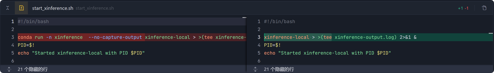

2、后续发现xinference与chatchat虚拟环境不在同一处，改为用完整路径调用xinference

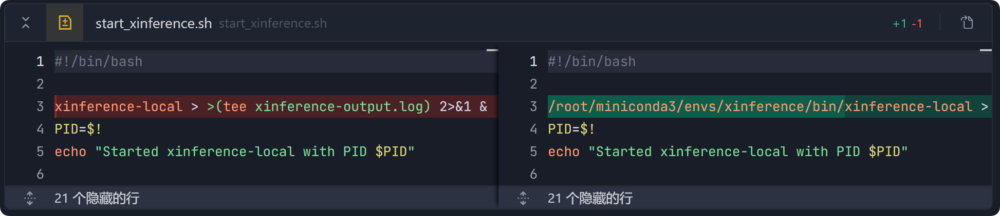

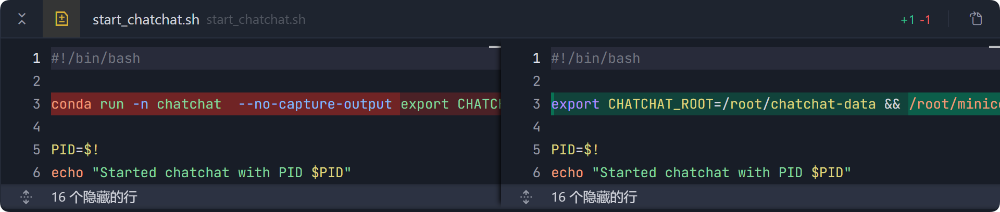

3、第一次成功打开 WebUI


4、第二次对话失败，原因是未能成功加载glm-4-9b-chat模型

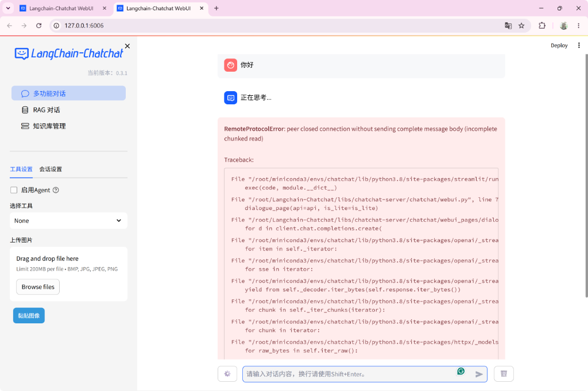

4、删除原有损坏的模型，重新下载

```bash
# 删除已存在的目录（可能是损坏的链接）
rm -rf /root/autodl-tmp/glm-4-9b-chat

# 重新下载模型
bash /root/download_model.sh
```

5、重新启动

```bash
cd /root
bash startup.sh
```

6、第三次成功实现对话


7、在知识库中添加自定义文件（如许多许多的论文）

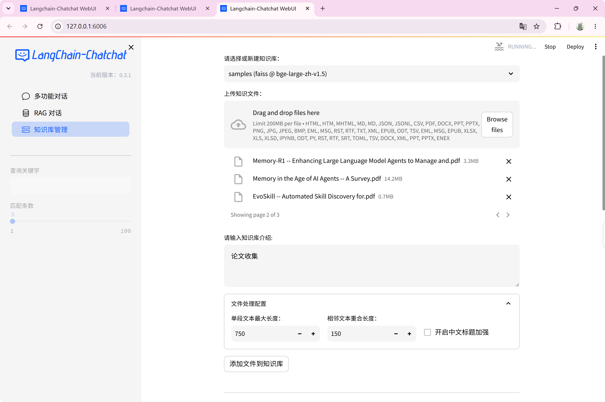

8、添加成功并开始重建向量库（等待时间比较漫长

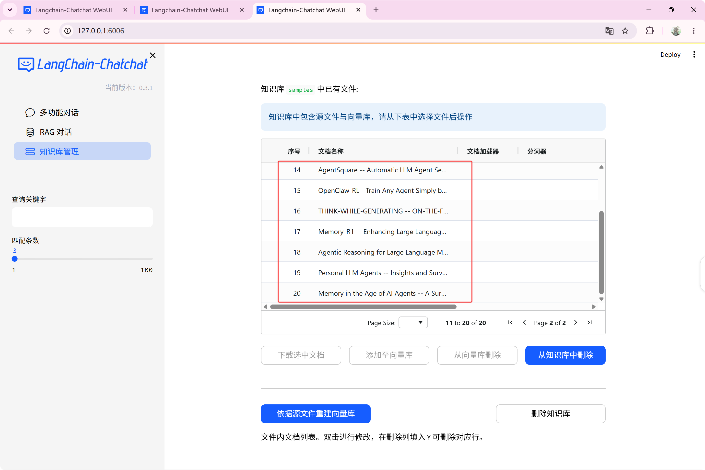

可以看到终端在后台狂飙（冷知识：每一个文件都要经历一次，文件越大时间越久，markdown加载速度要比其他的快不少）

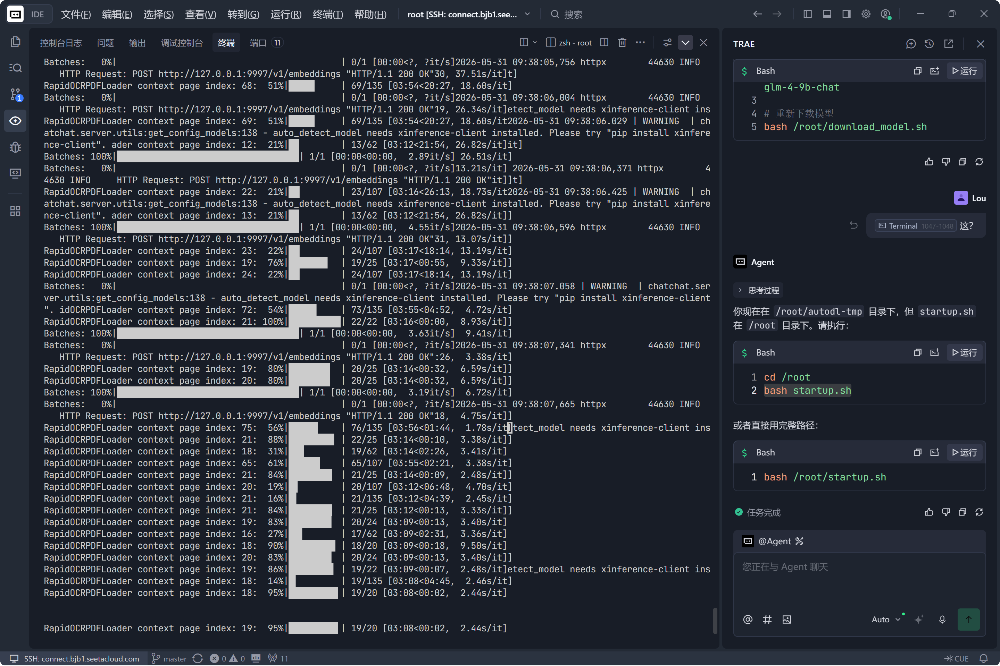

上传完毕，完成！！！


9、查询知识库中的论文

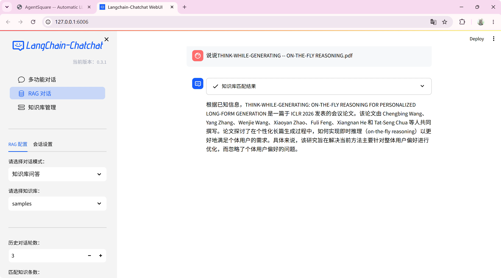

10、上传个人信息

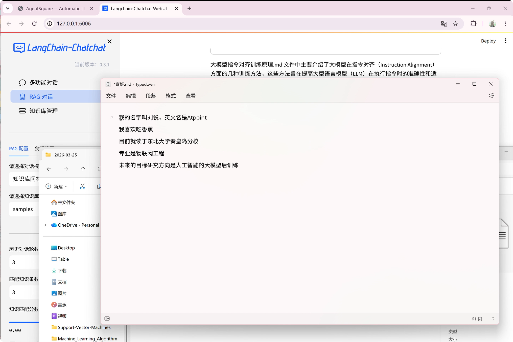

11、进行测试，能很快地进行信息检索

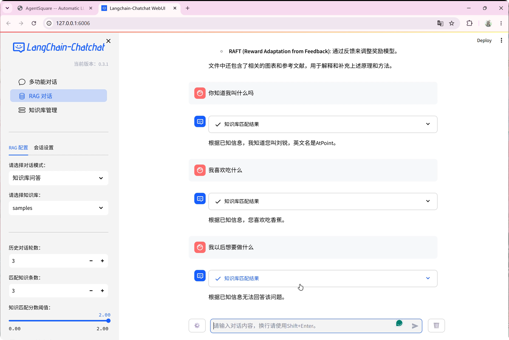

12、模型还是有点问题，只能回答死板问题，后续还要经过后训练来提升能力

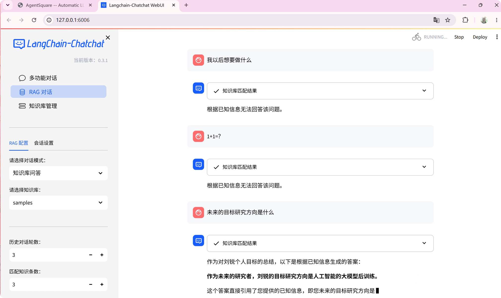


13、[详细演示--视频](https://www.bilibili.com/video/BV1GbVE6VEMA/)
