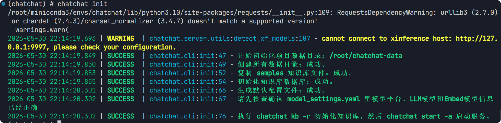
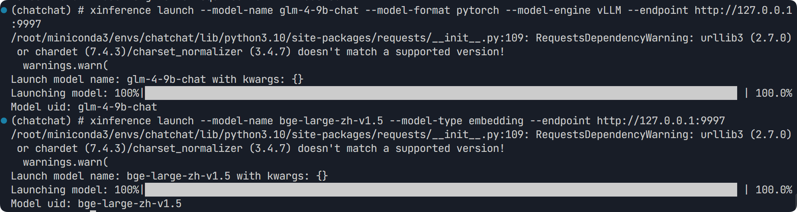

直接利用 AutoDL 的社区镜像 [AutoDL.Art | 能复现才是好算法](https://www.codewithgpu.com/i/chatchat-space/Langchain-Chatchat/Langchain-Chatchat)


需要重新配置一个 python <= 3.11 的虚拟环境

```bash
conda create -n chatchat python=3.10 -y
```

激活并检查

```bash
source ~/.bashrc
conda activate chatchat
```


使用官方安装指令

```bash
pip install "langchain-chatchat[xinference]" -U
```

初始化项目配置

```bash
chatchat init
```



可以修改 /chatchat-data/model_settings.yaml 来更换配置


安装 xinference 框架，并在后台启动

```bash
pip install xinference
nohup xinference -p 9997 -H 0.0.0.0 &
```

使用 vLLM 引擎，加载 LLM 模型

```bash
xinference launch --model-name glm-4-9b-chat --model-format pytorch --model-engine vLLM --endpoint http://127.0.0.1:9997
```

加载 Embedding 模型

```bash
xinference launch --model-name bge-large-zh-v1.5 --model-type embedding --endpoint http://127.0.0.1:9997
```




chatchat kb -r
